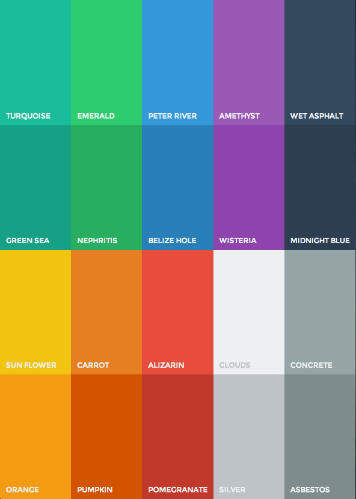

# Buttons

by Ty-Lucas Kelley

---

I took the colors from [http://flatuicolors.com](http://flatuicolors.com) and made lots of nice buttons using Sass.

### Installation

**Bower**

You can get the compiled CSS file via the Bower package manager:

    $ bower install flatui-buttons

**Install Script**

Run the install script (will create a `buttons` directory and install everything there):

    $ curl -s https://raw.githubusercontent.com/tylucaskelley/buttons/master/install.sh | sh

This will install all of the Sass files. If you want the minified CSS instead, simply do this:

    $ curl -sO https://raw.githubusercontent.com/tylucaskelley/buttons/master/css/buttons.css

### Examples

See the [examples.html](https://raw.githack.com/tylucaskelley/buttons/master/examples.html) file!

My [personal website](http://www.tylucaskelley.com) also utilizes these buttons and colors.

### Usage

I've set it up so you can use `a` tags:

    <a href='somewhere.over.the.rainbow'>
        
hello

    </a>

Or, you can use `button` tags:

    <button class='wet-asphalt-rect-xl'>hello</button>

The only thing you need to customize is the font!

### All Options

**Shapes**

* circle
* rect
* square

**Sizes**

* xs
* sm
* md
* lg
* xl

**Colors**

You can use any of these colors:

### To-do

* Break up things into smaller files
    *  people don't have to include one large CSS file in their project if they only want the red buttons / square buttons / etc.
